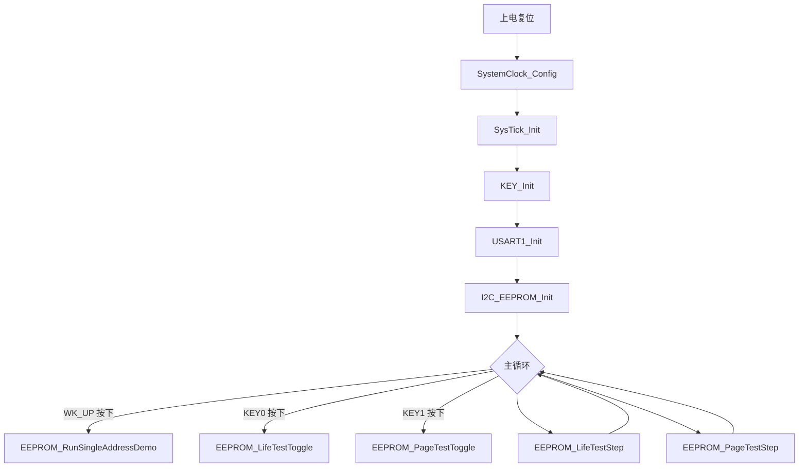

## 工程概述

本工程基于 Keil MDK，运行在 STM32F407 平台，用于验证 I2C EEPROM/FRAM 芯片。**支持三种芯片配置**：

1. **M24M02** (256 KB) - ST/Microchip EEPROM，256字节页
2. **M24512E** (64 KB) - ST/Microchip EEPROM，128字节页
3. **FM24C02C** (256 字节) - 上海复旦 FRAM，8字节页

主要功能：

- 单地址读写演示，确认 I2C 连接是否正常
- 4 字节交替写入寿命测试
- 整页写入寿命测试（交替两种数据模式）
- 通过 USART1 输出调试信息，便于观察测试过程

## 芯片配置选择

### 配置对比表

| 芯片型号 | 容量 | 页大小 | I2C地址 | 配置方法 | 详细说明 |
|---------|------|--------|---------|----------|----------|
| M24M02 | 256 KB | 256字节 | 0xA0-0xA6 | 默认配置 | 本文档 |
| M24512E | 64 KB | 128字节 | 0xA0 | 宏定义切换 | [README_M24512E.md](README_M24512E.md) |
| FM24C02C | 256 字节 | 8字节 | 0xA0 | 宏定义切换 | [README_FM24C02C.md](README_FM24C02C.md) |

### 配置切换方法

本工程通过**宏定义**支持三种芯片配置切换，有两种使用方式：

#### 方法一：在 Keil MDK 中设置（推荐）

1. 打开 Keil 工程
2. 菜单栏选择 `Project` → `Options for Target...` (或按 Alt+F7)
3. 选择 `C/C++` 选项卡
4. 在 `Preprocessor Symbols` 的 `Define:` 框中添加以下之一：
   - `USE_M24M02` - 使用 M24M02 (256KB，默认)
   - `USE_M24512E` - 使用 M24512E (64KB)
   - `USE_FM24C02C` - 使用 FM24C02C (256字节)
5. 点击 OK 保存
6. 重新编译工程（`Project` → `Rebuild all target files`）

**示例截图位置**：Options for Target → C/C++ → Define 输入框

#### 方法二：直接修改 config.h 文件

打开 `USER\APP\config.h` 文件，找到芯片选择区域，取消对应芯片的注释：

```c
// 芯片选择：取消下面某一行的注释来选择芯片
//#define USE_M24M02       // M24M02:  256KB EEPROM, 256字节页
//#define USE_M24512E      // M24512E: 64KB EEPROM,  128字节页
//#define USE_FM24C02C     // FM24C02C: 256字节 FRAM, 8字节页
```

例如，使用 M24512E 时，取消注释：
```c
#define USE_M24512E      // M24512E: 64KB EEPROM,  128字节页
```

> **重要提示**: 切换配置后必须重新编译整个工程（Rebuild），确保所有模块使用正确的参数。

## 构建与运行

1. **选择芯片配置**（参见上面的"芯片配置选择"章节）
2. 在 Keil MDK-ARM 5.x 中打开 `USER/pro.uvprojx`
3. 将 STM32F407 开发板的 PB8/PB9 接到 EEPROM/FRAM 的 SCL/SDA，并确保供电和地线共用
4. 使用 PA0、PE4、PE3 分别接入 WK_UP、KEY0、KEY1 按键
5. 编译工程（`Project` → `Build target`），然后下载到芯片（`Flash` → `Download`）
6. 将 USB-TTL 串口连接到 PA9（TX）/PA10（RX），设置波特率 115200 8N1，用于查看日志
7. 复位后按键功能：
   - **WK_UP**：执行一次单地址读写演示（单次触发）
   - **KEY0**：启动 4 字节寿命测试，测试将持续运行直至出错或复位
   - **KEY1**：启动整页寿命测试，测试将持续运行直至出错或复位

## 文件说明

- `USER/main.c`  
  完成系统时钟、SysTick、按键、串口、I2C EEPROM 初始化；主循环轮询按键并驱动寿命测试状态机。

- `USER/APP/delay.c` / `delay.h`  
  基于 SysTick 的微秒/毫秒级忙等待延时函数。

- `USER/APP/key.c` / `key.h`  
  初始化按键 GPIO，并提供带消抖的扫描函数。

- `USER/APP/uart.c` / `uart.h`  
  配置 USART1 为 115200 bps，提供发送字符、字符串、十六进制、十进制的工具函数。

- `USER/APP/config.h`  
  **芯片配置文件**，通过宏定义支持三种芯片。包含：EEPROM 容量、页大小、测试地址、写入模式等参数。

- `USER/APP/iic.c` / `iic.h`  
  使用 STM32F4 硬件 I2C1 实现 EEPROM/FRAM 的字节读写、ACK 轮询，并封装单地址演示、4 字节寿命测试、整页寿命测试逻辑。

- `USER/APP/config_M24512E.h` / `config_FM24C02C.h`  
  独立的配置文件参考（可选），保留作为参考用途。

如需新增模块或修改功能，请保持文件头部注释格式一致，并同步更新本 README。

## 流程图



## 串口输出示例

以下为在**工作正常**时典型的串口输出格式，仅用于帮助理解流程，具体数值以实际运行为准。

### 上电复位后

复位完成并初始化外设后，串口会输出一段帮助信息，例如：

```text
==== M24M02 test ====
WK_UP: single address R/W demo (one-shot)
KEY0: 4-byte life test START (runs until reset or error)
KEY1: page life test START (runs until reset or error)
```

此时尚未启动任何寿命测试，串口保持空闲。

### 按下 WK_UP（单地址读写演示）

假设 `TARGET_EEPROM_ADDRESS = 0x000200`，`TARGET_EEPROM_VALUE = 0x6A`，一次完整演示正常情况下类似：

```text
[INFO] Start write address 000200 data 6A -> write success
[INFO] Verify after write: 6A -> verify ok
[INFO] Standalone read address 000200 -> read success value 6A
```

这段只在按下 WK_UP 时执行一次，不会循环输出。

### 按下 KEY0（4 字节寿命测试）

第一次按 KEY0，启动 4 字节寿命测试，先输出启动信息：

```text
[4byte] life test start addr 000066 len 01 pattern AA/55
```

随后在测试正常进行时，每完成一轮校验 OK，会输出：

```text
test number 100 OK
test number 200 OK
...
```

如果某一轮出现数据不一致，示例输出为：

```text
Data mismatch @ 0x000066 Expected:0xAA Actual:0x3F
test number 12345 NO
[4byte] life test stop reason: data mismatch total writes 12344
```

### 按下 KEY1（整页寿命测试）

第一次按 KEY1，启动整页寿命测试，先输出启动信息：

```text
[page] page test start addr 000800 len 0100 pattern 55/AA
```

页测试正常运行时，每完成一整页写入+整页校验 OK，会输出：

```text
[page] Count 1 OK
[page] Count 2 OK
...
```

若在某一轮中发现数据不一致，则输出：

```text
Count 678 NO 00
[page] page test stop reason: data mismatch total cycles 677
```

### 同时启动 KEY0 与 KEY1

如果依次按下 KEY0 和 KEY1，两类寿命测试会在主循环中交替推进，串口上会看到两种测试信息交错出现。
