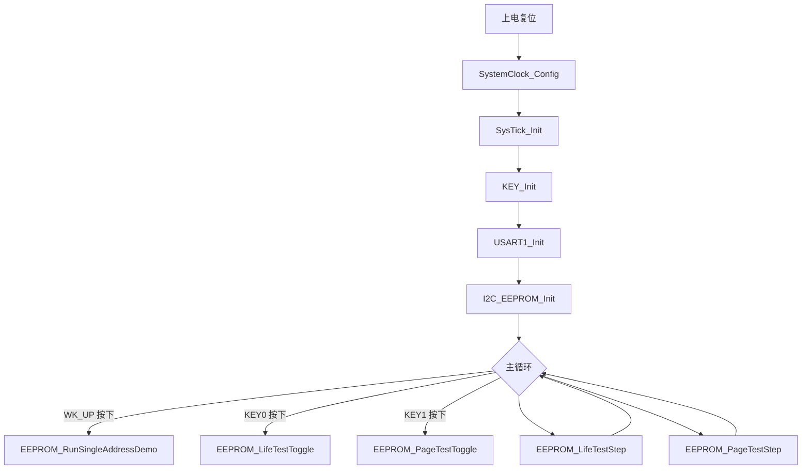

## 工程概述

本工程基于 Keil MDK，运行在 STM32F407 平台，用于验证 Microchip/ST 的 M24M02（256 KB）EEPROM。主要功能：

- 单地址读写演示，确认 I2C 连接是否正常；
- 4 字节交替写入寿命测试；
- 整页写入寿命测试（交替两种数据模式）；
- 通过 USART1 输出调试信息，便于观察测试过程。

## 构建与运行

1. 在 Keil MDK-ARM 5.x 中打开 `USER/pro.uvprojx`（或 `pro.uvguix.long`）。
2. 将 STM32F407 开发板的 PB8/PB9 接到 EEPROM 的 SCL/SDA，并确保供电和地线共用。
3. 使用 PA0、PE4、PE3 分别接入 WK_UP、KEY0、KEY1 按键。
4. 编译工程（Project → Build target），然后下载到芯片（Flash → Download）。
5. 将 USB-TTL 串口连接到 PA9（TX）/PA10（RX），设置波特率 115200 8N1，用于查看日志。
6. 复位后按键功能：
   - WK_UP：执行一次单地址读写演示（单次触发）；
   - KEY0：启动 4 字节寿命测试，测试将持续运行直至出错或复位；
   - KEY1：启动整页寿命测试，测试将持续运行直至出错或复位。

## 文件说明

- `USER/main.c`  
  完成系统时钟、SysTick、按键、串口、I2C EEPROM 初始化；主循环轮询按键并驱动寿命测试状态机。

- `USER/APP/delay.c` / `delay.h`  
  基于 SysTick 的微秒/毫秒级忙等待延时函数。

- `USER/APP/key.c` / `key.h`  
  初始化按键 GPIO，并提供带消抖的扫描函数：`KEY_Scan`、`KEY0_Scan`、`KEY1_Scan`。

- `USER/APP/uart.c` / `uart.h`  
  配置 USART1 为 115200 bps，提供发送字符、字符串、十六进制、十进制的工具函数。

- `USER/APP/config.h`  
  EEPROM 容量、页大小、测试地址、写入模式等参数集中配置。

- `USER/APP/iic.c` / `iic.h`  
  使用 STM32F4 硬件 I2C1 实现 M24M02 的字节读写、ACK 轮询，并封装单地址演示、4 字节寿命测试、整页寿命测试逻辑。

如需新增模块或修改功能，请保持文件头部注释格式一致，并同步更新本 README。

## 流程图



## 串口输出示例

以下为在**工作正常**时典型的串口输出格式，仅用于帮助理解流程，具体数值以实际运行为准。

### 上电复位后

复位完成并初始化外设后，串口会输出一段帮助信息，例如：

```text
==== M24M02 test ====
WK_UP: single address R/W demo (one-shot)
KEY0: 4-byte life test START (runs until reset or error)
KEY1: page life test START (runs until reset or error)
```

此时尚未启动任何寿命测试，串口保持空闲。

### 按下 WK_UP（单地址读写演示）

假设 `TARGET_EEPROM_ADDRESS = 0x000200`，`TARGET_EEPROM_VALUE = 0x6A`，一次完整演示正常情况下类似：

```text
[INFO] Start write address 000200 data 6A -> write success
[INFO] Verify after write: 6A -> verify ok
[INFO] Standalone read address 000200 -> read success value 6A
```

这段只在按下 WK_UP 时执行一次，不会循环输出。

### 按下 KEY0（4 字节寿命测试）

第一次按 KEY0，启动 4 字节寿命测试，先输出启动信息：

```text
[LIFE] life test start addr 000400 len 04 pattern AA/55
```

随后在测试正常进行时，每完成一轮 "4 字节全部写完并校验 OK"，会输出：

```text
Count 1 OK
Count 2 OK
Count 3 OK
...
```

如果某一轮出现写入失败、读出失败或数据不一致，示例输出为：

```text
Count 12345 NO 3F
[LIFE] life test stop reason: data mismatch total writes 12344
```
Count 12345 NO 3F：第 12345 轮出错，读到的值是 0x3F。
接着 life test stop 给出停止原因和上一轮成功的总写轮数。
此时 4 字节寿命测试停止，只有在再次复位并重新启动后才会继续。

### 按下 KEY1（整页寿命测试）

第一次按 KEY1，启动整页寿命测试，先输出启动信息：

```text
[PAGE] page test start addr 000800 len 0100 pattern 55/AA
```

页测试正常运行时，每完成一整页写入+整页校验 OK，会输出：

```text
Count 1 OK
Count 2 OK
Count 3 OK
...
```

若在某一轮中发现数据不一致，则输出类似：

```text
Count 678 NO 00
[PAGE] page test stop reason: data mismatch total cycles 677
```
第 678 轮出错，读到数据 0x00。
页测试停止，总共成功跑了 677 轮。
此时页寿命测试停止，只有在再次复位并重新启动后才会继续。

### 同时启动 KEY0 与 KEY1

如果依次按下 KEY0 和 KEY1，两类寿命测试会在主循环中交替推进，串口上会看到两种 `Count N OK` 行交错出现。

